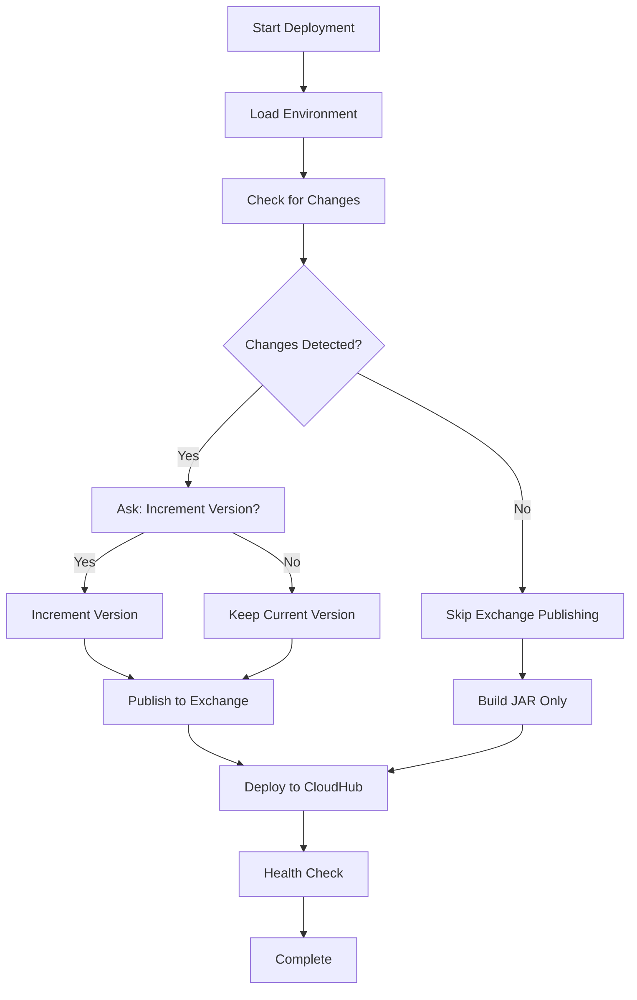

# Deploy.bat Script Analysis & Exchange Best Practices Compliance

## 🔍 Script Analysis Summary

After reviewing your `deploy.bat` script against the Exchange publishing best practices outlined in the main guidance document, here are the critical findings and recommendations:

## ❌ **Critical Issues Found**

### 1. **Automatic Version Increment (MAJOR ISSUE)**
```batch
# Current problematic approach:
set /a NEW_PATCH=!PATCH!+1
set "NEW_VERSION=!MAJOR!.!MINOR!.!NEW_PATCH!"
```

**❌ Problem**: Script automatically increments version on EVERY deployment, regardless of whether actual changes exist.

**✅ Recommendation**: Only increment version when there are actual functional changes.

### 2. **Incorrect MCP Asset Type (CRITICAL)**
```batch
# Current script creates:
echo   "classifier": "mule-application", >> exchange.json
```

**❌ Problem**: Uses `mule-application` classifier for MCP assets (contradicts best practices).

**✅ Should be**: `"classifier": "mcp"` for MCP servers.

### 3. **Forced Exchange Publishing**
```batch
# Current approach:
-Dexchange.skip=false
```

**❌ Problem**: Forces publishing even when no changes exist, violating "publish only when necessary" principle.

### 4. **No Change Detection Logic**
The script lacks any mechanism to detect whether actual changes have been made since the last deployment.

## ✅ **Positive Aspects**

1. **Connectivity Testing**: Good approach testing repository connectivity
2. **Retry Logic**: Implements proper retry mechanism for Exchange publishing
3. **Error Handling**: Comprehensive error handling and logging
4. **Environment Management**: Proper environment variable loading
5. **Multi-Service Support**: Handles multiple MCP services correctly

## 🚀 **Recommended Improvements**

### 1. **Add Change Detection Logic**

```batch
REM === CHANGE DETECTION LOGIC ===
echo ==============================
echo 🔍 DETECTING CHANGES
echo ==============================

set CHANGES_DETECTED=false
set PUBLISH_TO_EXCHANGE=false

REM Check Git status for changes
git status --porcelain > changes.tmp 2>nul
if !errorlevel! equ 0 (
    for /f %%i in (changes.tmp) do (
        set CHANGES_DETECTED=true
        goto :changes_found
    )
) else (
    echo ⚠️  Git not available, assuming changes exist
    set CHANGES_DETECTED=true
)

:changes_found
del changes.tmp 2>nul

REM Check if this is a new version number
if "!CHANGES_DETECTED!"=="true" (
    echo ✅ Changes detected - Exchange publishing enabled
    set PUBLISH_TO_EXCHANGE=true
) else (
    echo ℹ️  No changes detected - Skipping Exchange publishing
    set PUBLISH_TO_EXCHANGE=false
)
```

### 2. **Fix MCP Asset Type Creation**

```batch
REM Create proper MCP exchange.json
if not exist "exchange.json" (
    echo   📄 Creating MCP-compliant exchange.json...
    echo { > exchange.json
    echo   "name": "!SRV! MCP Server", >> exchange.json
    echo   "description": "MCP Server for Employee Onboarding - !SRV! component", >> exchange.json
    echo   "version": "!CURRENT_VERSION!", >> exchange.json
    echo   "groupId": "!ANYPOINT_ORG_ID!", >> exchange.json
    echo   "assetId": "!SRV!", >> exchange.json
    echo   "classifier": "mcp", >> exchange.json
    echo   "assetType": "mcp-server", >> exchange.json
    echo   "keywords": ["mcp", "employee-onboarding", "agent-network"], >> exchange.json
    echo   "tags": ["MCP Server", "Agent Network", "Employee Management"], >> exchange.json
    echo   "categories": ["Agent Network", "MCP", "Employee Management"] >> exchange.json
    echo } >> exchange.json
)
```

### 3. **Conditional Version Management**

```batch
REM Only increment version if changes detected and user confirms
if "!PUBLISH_TO_EXCHANGE!"=="true" (
    echo   📋 Current version: !CURRENT_VERSION!
    set /p INCREMENT_VERSION="🤔 Increment version for this deployment? (y/n): "
    
    if /i "!INCREMENT_VERSION!"=="y" (
        REM Parse version and increment patch number
        for /f "tokens=1,2,3 delims=." %%a in ("!CURRENT_VERSION!") do (
            set "MAJOR=%%a"
            set "MINOR=%%b"  
            set "PATCH=%%c"
        )
        
        set /a NEW_PATCH=!PATCH!+1
        set "NEW_VERSION=!MAJOR!.!MINOR!.!NEW_PATCH!"
        
        echo   🔢 Version increment: !CURRENT_VERSION! → !NEW_VERSION!
        
        REM Update pom.xml version
        powershell -Command "(Get-Content pom.xml) -replace '<version>!CURRENT_VERSION!</version>', '<version>!NEW_VERSION!</version>' | Set-Content pom.xml"
    ) else (
        set "NEW_VERSION=!CURRENT_VERSION!"
        echo   ℹ️  Keeping version: !NEW_VERSION!
    )
) else (
    set "NEW_VERSION=!CURRENT_VERSION!"
    echo   ⏭️  No version change needed: !NEW_VERSION!
)
```

### 4. **Conditional Exchange Publishing**

```batch
REM Only publish to Exchange if changes exist
if "!PUBLISH_TO_EXCHANGE!"=="true" (
    if "!REPO_AVAILABLE!"=="true" (
        echo   📤 Publishing to Exchange (changes detected)...
        call mvn clean deploy -DaltDeploymentRepository=anypoint-exchange::default::https://maven.anypoint.mulesoft.com/api/v1/organizations/!ANYPOINT_ORG_ID!/maven -Danypoint.platform.client_id="!ANYPOINT_CLIENT_ID!" -Danypoint.platform.client_secret="!ANYPOINT_CLIENT_SECRET!" -DskipTests -Dexchange.skip=false -q
    ) else (
        echo   ⚠️  Repository unavailable - Skipping Exchange publishing
    )
) else (
    echo   ⏭️  No changes - Skipping Exchange publishing
    echo   📦 Building JAR for CloudHub deployment only...
    call mvn clean package -DskipTests -Dexchange.skip=true -q
)
```

## 📋 **Deployment Script Compliance Checklist**

### ❌ **Current Issues to Fix**
- [ ] **Automatic version increment** - Remove forced version bumping
- [ ] **Incorrect asset classifier** - Change from `mule-application` to `mcp`
- [ ] **Forced Exchange publishing** - Add conditional logic
- [ ] **No change detection** - Add Git-based change detection
- [ ] **Missing asset type** - Add `assetType: "mcp-server"`

### ✅ **Good Practices Already Implemented**
- [x] **Error handling** - Comprehensive error checking
- [x] **Retry logic** - Exchange publishing retries
- [x] **Connectivity testing** - Repository availability check
- [x] **Multi-service support** - Handles all MCP servers
- [x] **Environment management** - Proper variable loading

## 🎯 **Recommended Deployment Flow**



## 🚨 **Immediate Action Items**

### **High Priority (Fix Now)**
1. **Fix MCP Asset Types**: Update exchange.json creation to use `"classifier": "mcp"`
2. **Add Change Detection**: Implement Git-based change detection
3. **Remove Forced Versioning**: Only increment version when needed
4. **Add Conditional Publishing**: Skip Exchange when no changes

### **Medium Priority (Next Sprint)**
1. **Add User Prompts**: Ask user about version increment
2. **Implement Semantic Versioning**: Better version management logic
3. **Enhanced Logging**: More detailed change detection reporting

### **Low Priority (Future Enhancement)**
1. **Automated Testing**: Add pre-deployment tests
2. **Rollback Mechanism**: Add deployment rollback capability
3. **Performance Monitoring**: Add deployment time tracking

## 💡 **Best Practice Implementation Example**

Here's a snippet showing the ideal approach:

```batch
REM === BEST PRACTICE EXAMPLE ===
if "!CHANGES_DETECTED!"=="true" (
    echo ✅ Changes found - proceeding with Exchange publishing
    if "!VERSION_INCREMENT!"=="true" (
        echo 🔢 Publishing new version !NEW_VERSION! to Exchange
        call mvn clean deploy -Dexchange.skip=false [...]
    ) else (
        echo 📦 Publishing current version !CURRENT_VERSION! to Exchange
        call mvn clean deploy -Dexchange.skip=false [...]
    )
) else (
    echo ℹ️  No changes detected - building for CloudHub only
    call mvn clean package -Dexchange.skip=true [...]
)
```

## 📞 **Summary and Next Steps**

Your `deploy.bat` script is well-structured but needs critical updates to align with Exchange best practices:

1. **🔴 Critical**: Fix MCP asset type classification
2. **🟡 Important**: Add change detection logic  
3. **🟢 Enhancement**: Implement conditional publishing

These changes will ensure your deployment process follows MuleSoft best practices and prevents unnecessary Exchange publications while maintaining proper MCP asset classification.
