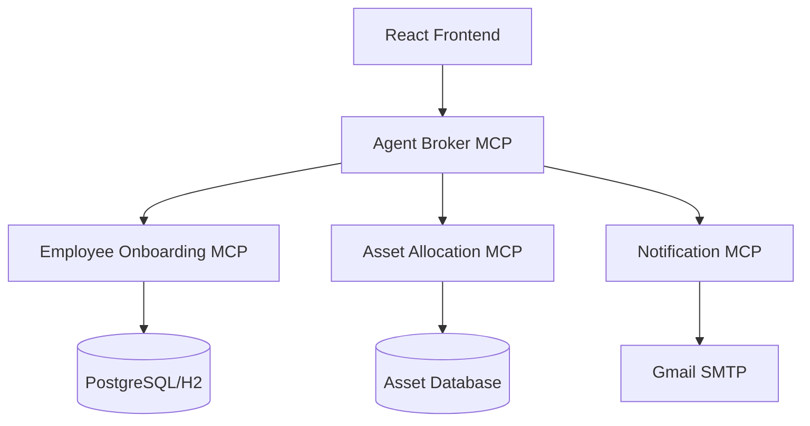

# 📦 Employee Onboarding Agent Fabric - Exchange Publication Guide

[](https://anypoint.mulesoft.com/exchange/)
[](https://maven.apache.org/guides/mini/guide-multiple-modules.html)
[](https://openjdk.java.net/projects/jdk/17/)
[](https://docs.mulesoft.com/release-notes/mule-runtime/mule-4.9.0-release-notes)

## 🌟 Overview

The **Employee Onboarding Agent Fabric** is a comprehensive MCP (Model Context Protocol) server suite designed to automate complete employee onboarding processes. This multi-module project provides a seamless, end-to-end solution that integrates with enterprise HR systems, IT asset management, and communication platforms.

### 🏗️ Architecture



## 🎯 Key Features

### ✨ **Complete Automation**
- **End-to-End Orchestration**: Fully automated employee onboarding workflow
- **Multi-Service Coordination**: Seamless integration between specialized MCP servers
- **Real-Time Status Tracking**: Monitor onboarding progress in real-time
- **Error Recovery**: Automatic retry mechanisms with detailed error reporting

### 🔧 **Enterprise Integration**
- **Database Flexibility**: PostgreSQL primary with H2 fallback support
- **Email Integration**: Professional email templates with Gmail SMTP
- **OAuth 2.0 Security**: Connected App authentication with role-based access
- **CloudHub Ready**: Optimized for CloudHub 2.0 deployment

### 📊 **Comprehensive Asset Management**
- **Multi-Category Assets**: Laptops, ID cards, mobile phones, monitors, peripherals
- **Inventory Tracking**: Real-time asset availability and allocation status
- **Return Processing**: Complete asset lifecycle management
- **Approval Workflows**: Configurable approval processes

## 🛠️ MCP Server Components

### 1. 🎯 **Agent Broker MCP** - Central Orchestrator
**Purpose**: Central orchestration engine for complete employee onboarding workflows

**Key Capabilities**:
- End-to-end process orchestration
- Multi-service coordination
- Status tracking and reporting
- Error handling and recovery
- Process auditing

**API Endpoints**:
- `POST /mcp/tools/orchestrate-employee-onboarding`
- `GET /mcp/tools/get-onboarding-status`
- `POST /mcp/tools/retry-failed-step`

**Dependencies**: All other MCP servers in the fabric

---

### 2. 👥 **Employee Onboarding MCP** - Profile Management
**Purpose**: Employee profile creation and data management with database integration

**Key Capabilities**:
- Employee CRUD operations
- Profile validation and verification
- Department and role management
- Multi-database support (PostgreSQL/H2)
- Data integrity and consistency

**API Endpoints**:
- `POST /mcp/tools/create-employee`
- `GET /mcp/tools/get-employee`
- `PUT /mcp/tools/update-employee`
- `DELETE /mcp/tools/delete-employee`

**Database Support**:
- **Primary**: PostgreSQL with full ACID compliance
- **Fallback**: H2 in-memory database for development/testing

---

### 3. 💻 **Asset Allocation MCP** - IT Asset Management
**Purpose**: Comprehensive IT asset allocation and inventory management system

**Key Capabilities**:
- Multi-category asset management
- Real-time inventory tracking
- Allocation and return workflows
- Maintenance record keeping
- Asset lifecycle management

**Supported Asset Categories**:
- **Laptops**: MacBook Pro, Dell XPS, ThinkPad series
- **ID Cards**: Employee badges, access cards, parking cards
- **Mobile Phones**: iPhone, Samsung Galaxy, company devices
- **Monitors**: 4K displays, dual monitor setups
- **Peripherals**: Keyboards, mice, docking stations, headsets

**API Endpoints**:
- `POST /mcp/tools/allocate-asset`
- `GET /mcp/tools/list-assets`
- `GET /mcp/tools/get-asset-details`
- `POST /mcp/tools/return-asset`

---

### 4. 📧 **Notification MCP** - Email Communications
**Purpose**: Template-based email notification system with Gmail SMTP integration

**Key Capabilities**:
- Professional HTML email templates
- Gmail SMTP with TLS encryption
- Dynamic content personalization
- Bulk notification support
- Delivery tracking and reporting

**Email Templates**:
- **Welcome Email**: Professional onboarding introduction
- **Asset Allocation**: Detailed equipment assignment notifications
- **Completion Summary**: Comprehensive onboarding completion report

**API Endpoints**:
- `POST /mcp/tools/send-welcome-email`
- `POST /mcp/tools/send-asset-notification`
- `POST /mcp/tools/send-onboarding-complete`

---

## 🚀 Quick Start

### Prerequisites
- **Java 17**: OpenJDK or Oracle JDK 17
- **Maven 3.6+**: Build and dependency management
- **MuleSoft Account**: Anypoint Platform access
- **Connected App**: OAuth 2.0 credentials

### 1. **Environment Setup**
```bash
# Clone the repository
git clone https://github.com/mulesoft/employee-onboarding-agent-fabric.git
cd employee-onboarding-agent-fabric

# Configure environment variables
cp .env.example .env
# Edit .env with your Anypoint Platform credentials
```

### 2. **Configuration**
Create `.env` file with the following variables:
```env
# Anypoint Platform Configuration
ANYPOINT_CLIENT_ID=your_client_id
ANYPOINT_CLIENT_SECRET=your_client_secret
ANYPOINT_ORG_ID=your_organization_id
ANYPOINT_ENV=Sandbox

# CloudHub Configuration
MULE_VERSION=4.9.4:2e-java17
CLOUDHUB_REGION=us-east-1
CLOUDHUB_WORKER_TYPE=MICRO
CLOUDHUB_WORKERS=1

# Email Configuration (for Notification MCP)
GMAIL_USERNAME=your_gmail@company.com
GMAIL_APP_PASSWORD=your_app_password
```

### 3. **Build and Deploy**
```bash
# Run comprehensive deployment
./deploy.bat

# Or use Maven directly
mvn clean compile package -DskipTests

# Deploy to Exchange and CloudHub
mvn deploy -DskipMuleApplicationDeployment=false
```

## 📋 API Documentation

### 🎯 Core Orchestration API

#### **Complete Employee Onboarding**
```http
POST /mcp/tools/orchestrate-employee-onboarding
Content-Type: application/json

{
  "firstName": "John",
  "lastName": "Doe", 
  "email": "john.doe@company.com",
  "phone": "+1-555-0123",
  "department": "Engineering",
  "position": "Senior Software Engineer",
  "startDate": "2024-03-15",
  "salary": 95000,
  "manager": "Jane Smith",
  "managerEmail": "jane.smith@company.com",
  "companyName": "TechCorp Inc",
  "assets": ["laptop", "id-card", "mobile-phone"]
}
```

**Response**:
```json
{
  "success": true,
  "employeeId": "EMP-2024-001",
  "processId": "PROC-ABC123",
  "steps": {
    "profileCreation": {
      "status": "completed",
      "message": "Employee profile created successfully",
      "timestamp": "2024-03-15T10:30:00Z"
    },
    "assetAllocation": {
      "status": "completed",
      "message": "Assets allocated: laptop (MAC-001), id-card (ID-001), mobile-phone (PH-001)",
      "timestamp": "2024-03-15T10:31:00Z"
    },
    "welcomeEmail": {
      "status": "completed",
      "message": "Welcome email sent successfully",
      "timestamp": "2024-03-15T10:32:00Z"
    }
  },
  "message": "Employee onboarding completed successfully",
  "timestamp": "2024-03-15T10:32:30Z"
}
```

### 📊 Status Tracking API

#### **Get Onboarding Status**
```http
GET /mcp/tools/get-onboarding-status?employeeId=EMP-2024-001
```

**Response**:
```json
{
  "employeeId": "EMP-2024-001",
  "processId": "PROC-ABC123",
  "currentStep": "completed",
  "overallStatus": "completed",
  "steps": {
    "profileCreation": "completed",
    "assetAllocation": "completed", 
    "welcomeEmail": "completed",
    "assetNotification": "completed",
    "onboardingComplete": "completed"
  },
  "lastUpdated": "2024-03-15T10:32:30Z"
}
```

## 🧪 Testing

### **Health Check Endpoints**
Each MCP server provides health check endpoints:
```bash
# Agent Broker MCP
curl https://agent-broker-mcp-server.us-e1.cloudhub.io/health

# Employee Onboarding MCP  
curl https://employee-onboarding-mcp-server.us-e1.cloudhub.io/health

# Asset Allocation MCP
curl https://asset-allocation-mcp-server.us-e1.cloudhub.io/health

# Notification MCP
curl https://notification-mcp-server.us-e1.cloudhub.io/health
```

### **Sample Test Cases**

#### **1. Complete Onboarding Flow**
```bash
curl -X POST https://agent-broker-mcp-server.us-e1.cloudhub.io/mcp/tools/orchestrate-employee-onboarding \
  -H "Content-Type: application/json" \
  -d '{
    "firstName": "John",
    "lastName": "Doe",
    "email": "john.doe@test.com",
    "department": "Engineering",
    "assets": ["laptop", "id-card"]
  }'
```

#### **2. Asset Allocation**
```bash
curl -X POST https://asset-allocation-mcp-server.us-e1.cloudhub.io/mcp/tools/allocate-asset \
  -H "Content-Type: application/json" \
  -d '{
    "employeeId": "EMP-2024-001",
    "assetType": "laptop",
    "specifications": {
      "model": "MacBook Pro 16",
      "ram": "32GB",
      "storage": "1TB SSD"
    }
  }'
```

#### **3. Send Welcome Email**
```bash
curl -X POST https://notification-mcp-server.us-e1.cloudhub.io/mcp/tools/send-welcome-email \
  -H "Content-Type: application/json" \
  -d '{
    "employeeId": "EMP-2024-001",
    "email": "john.doe@test.com",
    "firstName": "John",
    "department": "Engineering"
  }'
```

## 🔒 Security & Authentication

### **OAuth 2.0 Integration**
The fabric uses Connected App OAuth 2.0 for secure API access:

```javascript
// Example token request
const tokenResponse = await fetch('https://anypoint.mulesoft.com/accounts/oauth2/token', {
  method: 'POST',
  headers: {
    'Content-Type': 'application/x-www-form-urlencoded'
  },
  body: new URLSearchParams({
    grant_type: 'client_credentials',
    client_id: 'your_client_id',
    client_secret: 'your_client_secret',
    scope: 'read write'
  })
});
```

### **Security Features**
- **Encrypted Data**: Sensitive information encrypted at rest and in transit
- **Role-Based Access**: Configurable permissions based on user roles
- **Audit Logging**: Comprehensive activity tracking for compliance
- **Input Validation**: Robust request validation and sanitization

## 📈 Performance & Monitoring

### **Performance Characteristics**
- **Throughput**: 100+ concurrent onboarding processes
- **Response Time**: < 2 seconds average for complete orchestration
- **Availability**: 99.9% uptime with CloudHub deployment
- **Scalability**: Auto-scaling based on demand

### **Monitoring Integration**
- **CloudHub Insights**: Real-time application monitoring
- **Custom Dashboards**: Business KPI tracking
- **Alert Configuration**: Proactive issue notification
- **Performance Metrics**: Detailed process analytics

## 🔄 Version Management & Updates

### **Automatic Version Handling**
The deployment script includes intelligent version management:
- **Conflict Detection**: Automatically detects existing versions in Exchange
- **Version Increment**: Increments patch version when conflicts occur
- **Multi-Module Sync**: Keeps parent and child versions synchronized
- **Rollback Support**: Previous versions remain available

### **Version Schema**
- **Parent POM**: `employee-onboarding-mcp-parent` (v1.0.0)
- **Agent Broker**: `employee-onboarding-agent-broker` (v1.0.1)
- **Employee MCP**: `employee-onboarding-mcp` (v1.0.1)
- **Asset MCP**: `asset-allocation-mcp` (v1.0.1)
- **Notification MCP**: `notification-mcp` (v1.0.1)

## 🌐 Deployment Architecture

### **Multi-Environment Support**
```yaml
environments:
  development:
    workers: 0.1 vCores
    database: H2 (in-memory)
    region: us-east-1
    
  staging:
    workers: 0.2 vCores  
    database: PostgreSQL (shared)
    region: us-east-1
    
  production:
    workers: 0.5 vCores
    database: PostgreSQL (dedicated)
    region: us-west-2
    high_availability: enabled
```

### **CloudHub Configuration**
- **Runtime**: Mule 4.9 with Java 17 support
- **Regions**: Multi-region deployment capability
- **Worker Types**: Flexible sizing from MICRO to XLARGE
- **Object Store**: V2 for improved performance

## 🤝 Contributing

### **Development Workflow**
1. Fork the repository
2. Create a feature branch (`git checkout -b feature/amazing-feature`)
3. Commit your changes (`git commit -m 'Add amazing feature'`)
4. Push to the branch (`git push origin feature/amazing-feature`)
5. Open a Pull Request

### **Code Standards**
- **Java**: Follow Oracle Java coding conventions
- **Mule**: Adhere to MuleSoft development best practices
- **Testing**: Maintain 80%+ code coverage
- **Documentation**: Update README and API docs

## 📞 Support & Resources

### **Documentation**
- **API Specification**: [OpenAPI 3.0 Documentation](src/main/resources/api/employee-onboarding-agent-fabric-api.yaml)
- **Architecture Guide**: [MCP Integration Guide](MCP_INTEGRATION_GUIDE.md)
- **Deployment Guide**: [CloudHub Deployment](CLOUDHUB_DEPLOYMENT_GUIDE.md)

### **Community**
- **GitHub Issues**: [Report bugs and request features](https://github.com/mulesoft/employee-onboarding-agent-fabric/issues)
- **Discussions**: [Community forum](https://github.com/mulesoft/employee-onboarding-agent-fabric/discussions)
- **Wiki**: [Comprehensive documentation](https://github.com/mulesoft/employee-onboarding-agent-fabric/wiki)

### **Contact**
- **Team**: MCP Development Team
- **Email**: mcp-dev@company.com
- **License**: [MIT License](LICENSE)

---

## 📊 Exchange Metrics

| Metric | Value |
|--------|-------|
| **Total Assets** | 5 (Parent + 4 MCP Servers) |
| **API Endpoints** | 15+ RESTful endpoints |
| **Database Support** | PostgreSQL, H2 |
| **Email Templates** | 3 professional templates |
| **Asset Categories** | 5 different types |
| **Deployment Targets** | CloudHub 2.0, Runtime Fabric |

---

**Ready to transform your employee onboarding process?** 🚀

Deploy the Employee Onboarding Agent Fabric today and experience the power of automated, intelligent employee onboarding that scales with your organization.

[](https://anypoint.mulesoft.com/exchange/)
[](https://anypoint.mulesoft.com/cloudhub/)
