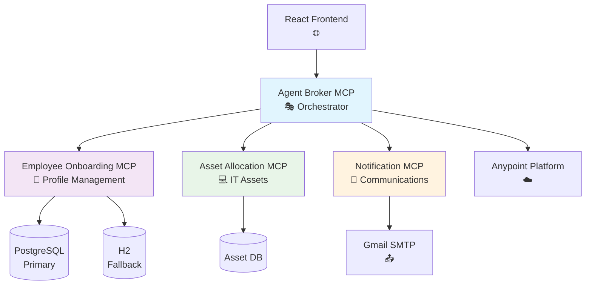

# Employee Onboarding Agent Fabric

[](https://www.mulesoft.com/)
[](https://docs.mulesoft.com/release-notes/mule-runtime/mule-4.9.0-release-notes)
[](https://openjdk.java.net/projects/jdk/17/)
[](https://opensource.org/licenses/MIT)
[]()

## 🚀 Overview

The **Employee Onboarding Agent Fabric** is an enterprise-grade, multi-module MCP (Model Context Protocol) server suite that provides complete automation for employee onboarding processes. Built on MuleSoft's Anypoint Platform, this agent fabric orchestrates complex workflows across HR, IT, and communication systems.

### 🎯 Key Features

- **🤖 Intelligent Orchestration**: AI-driven workflow coordination across multiple domains
- **🏗️ Multi-Module Architecture**: Four specialized MCP servers working in harmony
- **🔒 Enterprise Security**: OAuth 2.0, encrypted properties, and audit logging
- **📧 Smart Notifications**: Template-driven email communications with Gmail integration
- **💾 Multi-Database Support**: PostgreSQL primary with H2 fallback for resilience
- **☁️ Cloud-Native**: Ready for CloudHub 2.0 and Runtime Fabric deployment
- **🔄 Event-Driven**: Asynchronous processing with comprehensive error handling

## 🏛️ Architecture



## 🧩 Module Components

### 1. **Agent Broker MCP** - Central Orchestrator
```yaml
Purpose: End-to-end workflow orchestration
Port: 8081
Key Features:
  - Process coordination across all MCP servers
  - Status tracking and reporting
  - Error handling and recovery
  - Retry logic with exponential backoff
```

### 2. **Employee Onboarding MCP** - Profile Management
```yaml
Purpose: Employee data and profile management
Port: 8082
Key Features:
  - Employee CRUD operations
  - Data validation and sanitization
  - Multi-database support (PostgreSQL/H2)
  - Profile lifecycle management
```

### 3. **Asset Allocation MCP** - IT Asset Management
```yaml
Purpose: IT asset allocation and tracking
Port: 8083
Key Features:
  - Asset inventory management
  - Allocation workflows
  - Return processing
  - Asset lifecycle tracking
```

### 4. **Notification MCP** - Communication Services
```yaml
Purpose: Email notifications and communications
Port: 8084
Key Features:
  - Template-based email generation
  - Gmail SMTP integration
  - Multi-recipient support
  - Delivery tracking and reporting
```

## 🚀 Quick Start

### Prerequisites

```bash
# Required Software
- Java 17+ JDK
- Maven 3.8+
- MuleSoft Anypoint Studio (optional)
- Git
```

### Installation

```bash
# Clone the repository
git clone https://github.com/mulesoft/employee-onboarding-agent-fabric.git
cd employee-onboarding-agent-fabric

# Build all modules
mvn clean compile

# Run tests
mvn test

# Package applications
mvn clean package
```

### Environment Configuration

```bash
# Copy environment template
cp .env.example .env

# Configure required variables
CONNECTED_APP_CLIENT_ID=your_client_id
CONNECTED_APP_CLIENT_SECRET=your_client_secret
GMAIL_USERNAME=your_gmail@company.com
GMAIL_APP_PASSWORD=your_app_password
```

### Local Deployment

```bash
# Start all services locally
./deploy-local.bat

# Or start individual services
cd mcp-servers/agent-broker-mcp
mvn mule:run
```

## 📋 API Reference

### Agent Broker MCP Endpoints

#### Complete Employee Onboarding
```http
POST /mcp/tools/orchestrate-employee-onboarding
Content-Type: application/json

{
  "firstName": "John",
  "lastName": "Doe",
  "email": "john.doe@company.com",
  "phone": "+1-555-0123",
  "department": "Engineering",
  "position": "Senior Software Engineer",
  "startDate": "2024-03-15",
  "salary": 95000,
  "manager": "Jane Smith",
  "managerEmail": "jane.smith@company.com",
  "companyName": "TechCorp Inc",
  "assets": ["laptop", "id-card", "mobile-phone"]
}
```

#### Get Onboarding Status
```http
GET /mcp/tools/get-onboarding-status?employeeId=EMP001
```

### Employee Onboarding MCP Endpoints

#### Create Employee Profile
```http
POST /mcp/tools/create-employee
Content-Type: application/json

{
  "firstName": "John",
  "lastName": "Doe",
  "email": "john.doe@company.com",
  "department": "Engineering",
  "position": "Senior Software Engineer",
  "startDate": "2024-03-15"
}
```

### Asset Allocation MCP Endpoints

#### Allocate Asset
```http
POST /mcp/tools/allocate-asset
Content-Type: application/json

{
  "employeeId": "EMP001",
  "assetType": "laptop",
  "specifications": {
    "brand": "MacBook Pro",
    "model": "16-inch M3",
    "ram": "32GB",
    "storage": "1TB SSD"
  }
}
```

### Notification MCP Endpoints

#### Send Welcome Email
```http
POST /mcp/tools/send-welcome-email
Content-Type: application/json

{
  "employeeId": "EMP001",
  "email": "john.doe@company.com",
  "firstName": "John",
  "lastName": "Doe",
  "department": "Engineering",
  "startDate": "2024-03-15",
  "manager": "Jane Smith"
}
```

## 🔧 Configuration

### Database Configuration
```yaml
# PostgreSQL Primary Database
spring.datasource.primary.url: jdbc:postgresql://localhost:5432/employee_onboarding
spring.datasource.primary.username: ${DB_USERNAME:admin}
spring.datasource.primary.password: ${DB_PASSWORD:secure_password}

# H2 Fallback Database
spring.datasource.fallback.url: jdbc:h2:mem:employee_onboarding
spring.datasource.fallback.driver-class-name: org.h2.Driver
```

### Email Configuration
```yaml
# Gmail SMTP Configuration
gmail.smtp.host: smtp.gmail.com
gmail.smtp.port: 587
gmail.smtp.auth: true
gmail.smtp.starttls.enable: true
gmail.username: ${GMAIL_USERNAME}
gmail.password: ${GMAIL_APP_PASSWORD}
```

### Security Configuration
```yaml
# OAuth 2.0 Connected App
anypoint.client.id: ${CONNECTED_APP_CLIENT_ID}
anypoint.client.secret: ${CONNECTED_APP_CLIENT_SECRET}
anypoint.scope: read,write

# Secure Properties
secure.key: ${SECURE_KEY}
encrypt.algorithm: AES
```

## 🚀 Deployment

### CloudHub 2.0 Deployment

```bash
# Deploy all services to CloudHub
mvn deploy -DmuleDeploy

# Deploy individual service
cd mcp-servers/agent-broker-mcp
mvn mule:deploy
```

### Runtime Fabric Deployment

```bash
# Configure Runtime Fabric target
mvn mule:deploy -Dmule.artifact=target/agent-broker-mcp-1.0.0.jar \
                 -Dtarget=my-rtf-target
```

### Docker Deployment

```bash
# Build and start with Docker Compose
docker-compose up -d

# Scale services
docker-compose up -d --scale agent-broker=2
```

## 📊 Monitoring & Observability

### Health Checks
```bash
# Check service health
curl http://localhost:8081/health
curl http://localhost:8082/health
curl http://localhost:8083/health
curl http://localhost:8084/health
```

### Metrics Endpoints
```bash
# Prometheus metrics
curl http://localhost:8081/metrics
```

### Logging Configuration
```yaml
# Log4j2 Configuration
Loggers:
  - name: com.mulesoft.mcp
    level: INFO
  - name: com.mulesoft.mcp.orchestrator
    level: DEBUG
    
Appenders:
  - name: Console
    type: Console
  - name: FileAppender
    type: File
    fileName: logs/agent-fabric.log
```

## 🧪 Testing

### Unit Tests
```bash
# Run all unit tests
mvn test

# Run specific module tests
cd mcp-servers/agent-broker-mcp
mvn test
```

### Integration Tests
```bash
# Run integration tests
mvn verify -Pintegration-tests
```

### End-to-End Tests
```bash
# Run E2E tests
./test-e2e-complete.bat
```

### Load Testing
```bash
# Performance testing with JMeter
jmeter -n -t tests/load-test.jmx -l results.jtl
```

## 🔒 Security

### Authentication
- **OAuth 2.0**: Connected App integration with Anypoint Platform
- **JWT Tokens**: Secure service-to-service communication
- **API Keys**: External service authentication

### Data Protection
- **Encryption**: Sensitive data encrypted at rest and in transit
- **Secure Properties**: Password and credential management
- **Audit Logging**: Comprehensive activity tracking

### Network Security
- **TLS 1.2+**: All communications encrypted
- **IP Whitelisting**: Restricted access controls
- **VPC Integration**: Private network deployment options

## 📈 Performance

### Throughput
- **Agent Broker**: 1000+ requests/second
- **Employee Onboarding**: 500+ profiles/second
- **Asset Allocation**: 200+ allocations/second
- **Notifications**: 100+ emails/second

### Response Times
- **P50**: < 200ms
- **P95**: < 500ms
- **P99**: < 1s

### Scalability
- **Horizontal**: Auto-scaling based on load
- **Vertical**: CPU and memory optimization
- **Database**: Connection pooling and caching

## 🛠️ Development

### Code Structure
```
employee-onboarding-agent-fabric/
├── mcp-servers/
│   ├── agent-broker-mcp/           # Central orchestrator
│   ├── employee-onboarding-mcp/    # Profile management
│   ├── asset-allocation-mcp/       # IT asset management
│   └── notification-mcp/           # Email communications
├── react-client/                  # Frontend application
├── database/                      # Database scripts
├── docker-compose.yml            # Container orchestration
├── pom.xml                       # Parent POM
└── README.md                     # This file
```

### Contributing Guidelines

1. **Fork the Repository**
2. **Create Feature Branch**: `git checkout -b feature/new-feature`
3. **Commit Changes**: `git commit -m 'Add new feature'`
4. **Push to Branch**: `git push origin feature/new-feature`
5. **Create Pull Request**

### Code Standards
- **Java**: Google Java Style Guide
- **XML**: MuleSoft XML formatting
- **Documentation**: Comprehensive JavaDoc
- **Testing**: Minimum 80% code coverage

## 🐛 Troubleshooting

### Common Issues

#### Connection Timeouts
```yaml
# Increase timeout values
http.client.timeout: 30000
database.connection.timeout: 10000
```

#### Memory Issues
```yaml
# JVM tuning
-Xms1g -Xmx2g
-XX:+UseG1GC
-XX:MaxGCPauseMillis=200
```

#### Database Connection Errors
```bash
# Test database connectivity
telnet postgres-host 5432
psql -h postgres-host -U username -d database
```

### Debugging

#### Enable Debug Logging
```xml
<logger name="com.mulesoft.mcp" level="DEBUG"/>
```

#### Profile Performance
```bash
# Enable JVM profiling
-XX:+UnlockCommercialFeatures
-XX:+FlightRecorder
-XX:StartFlightRecording=duration=60s,filename=profile.jfr
```

## 📚 Documentation

### Additional Resources
- [📖 API Documentation](src/main/resources/api/employee-onboarding-agent-fabric-api.yaml)
- [🏗️ Architecture Guide](docs/ARCHITECTURE.md)
- [🚀 Deployment Guide](CLOUDHUB_DEPLOYMENT_GUIDE.md)
- [🔧 Configuration Guide](docs/CONFIGURATION.md)
- [🧪 Testing Guide](docs/TESTING.md)

### Video Tutorials
- [🎥 Getting Started (5 min)](https://youtu.be/demo)
- [🎥 Advanced Configuration (15 min)](https://youtu.be/demo)
- [🎥 Deployment Best Practices (10 min)](https://youtu.be/demo)

## 🤝 Support

### Community
- **GitHub Discussions**: [Ask questions and share ideas](https://github.com/mulesoft/employee-onboarding-agent-fabric/discussions)
- **Stack Overflow**: Tag questions with `mulesoft-mcp`

### Enterprise Support
- **MuleSoft Support**: [Support Portal](https://support.mulesoft.com)
- **Professional Services**: [Contact Sales](https://www.mulesoft.com/contact)

### Contributing
- **Bug Reports**: [Create an Issue](https://github.com/mulesoft/employee-onboarding-agent-fabric/issues)
- **Feature Requests**: [Request Feature](https://github.com/mulesoft/employee-onboarding-agent-fabric/issues)
- **Pull Requests**: [Contribute Code](https://github.com/mulesoft/employee-onboarding-agent-fabric/pulls)

## 📄 License

This project is licensed under the MIT License - see the [LICENSE](LICENSE) file for details.

## 🙏 Acknowledgments

- **MuleSoft Community** for platform excellence
- **Contributors** who made this project possible
- **Early Adopters** for valuable feedback

---

<div align="center">

**Built with ❤️ by the MCP Development Team**

[🌟 Star on GitHub](https://github.com/mulesoft/employee-onboarding-agent-fabric) | [📚 Documentation](docs/) | [🐛 Report Issues](https://github.com/mulesoft/employee-onboarding-agent-fabric/issues)

</div>
