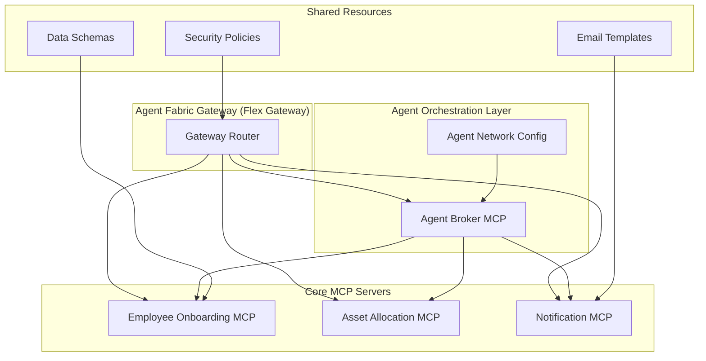

# Employee Onboarding Agent Fabric

## 🚀 Overview

A comprehensive **Mule Agent Fabric** implementation for automating the complete employee onboarding process. This standardized agent fabric orchestrates multiple MCP (Model Context Protocol) servers using intelligent agents to streamline HR operations, asset allocation, and communication workflows.

## ✨ Features

- **🤖 Intelligent Agent Orchestration**: Coordinated multi-agent workflows with LLM integration
- **🔧 MCP Server Architecture**: Standardized microservices using Model Context Protocol  
- **🌐 Flex Gateway Integration**: API management and routing with security policies
- **📋 Complete Onboarding Workflow**: End-to-end employee onboarding automation
- **💼 Asset Management**: Automated asset allocation and tracking
- **📧 Smart Notifications**: Personalized email communications with templates
- **🏥 Health Monitoring**: Comprehensive monitoring and alerting system
- **🔄 Automated Deployment**: One-click deployment with rollback capabilities

## 🏗️ Architecture



## 📁 Project Structure

```
employee-onboarding-agent-fabric/
├── fabric-config/              # Central fabric configuration
│   ├── agent-network.yaml      # Agent network and LLM settings
│   ├── gateway-config.yaml     # Flex Gateway configuration
│   └── deployment-config.yaml  # Deployment orchestration
├── mcp-servers/                # MCP server implementations
│   ├── employee-onboarding-mcp/# Employee management services
│   ├── asset-allocation-mcp/   # Asset allocation services
│   ├── notification-mcp/       # Email notification services
│   └── agent-broker-mcp/       # Agent orchestration broker
├── shared-resources/           # Shared fabric resources
│   ├── templates/              # Email templates
│   ├── schemas/                # Data validation schemas
│   ├── policies/               # Security and governance policies
│   └── global-configs/         # Shared configurations
├── deployment/                 # Deployment automation
│   ├── scripts/                # Automated deployment scripts
│   ├── environments/           # Environment-specific configs
│   └── monitoring/             # Health check and monitoring
├── docs/                       # Documentation
│   └── deployment-guide.md     # Comprehensive deployment guide
└── tests/                      # Testing framework
    ├── integration/            # End-to-end tests
    └── health-checks/          # Health validation
```

## 🚀 Quick Start

### Prerequisites

- **Java 17+** (Mule Runtime)
- **Maven 3.6+** (Build automation)  
- **Python 3.8+** (Deployment scripts)
- **Anypoint Platform Account** (CloudHub deployment)

### 1. Setup Environment

```bash
# Clone the repository
git clone <repository-url>
cd employee-onboarding-agent-fabric

# Configure environment
cp .env.template .env
# Edit .env with your settings

# Install dependencies
pip install requests groq urllib3
```

### 2. Deploy Agent Fabric

```bash
# Deploy to development environment
.\deployment\scripts\deploy-agent-fabric.bat development

# Verify deployment
.\deployment\scripts\health-check-all.bat development
```

### 3. Access the System

- **Agent Fabric Gateway**: `https://employee-onboarding-gateway.sandbox.anypoint.mulesoft.com`
- **Agent Broker**: `https://employee-onboarding-gateway.sandbox.anypoint.mulesoft.com/broker`
- **Employee Management**: `https://employee-onboarding-gateway.sandbox.anypoint.mulesoft.com/employee`
- **Asset Allocation**: `https://employee-onboarding-gateway.sandbox.anypoint.mulesoft.com/assets`
- **Notifications**: `https://employee-onboarding-gateway.sandbox.anypoint.mulesoft.com/notifications`

## 🔧 Configuration

### Environment Variables

Create a `.env` file with the following configuration:

```env
# Anypoint Platform
ANYPOINT_USERNAME=your-username
ANYPOINT_PASSWORD=your-password
ANYPOINT_ORG_ID=your-org-id
ANYPOINT_ENV_ID=your-env-id

# LLM Configuration (Groq)
GROQ_API_KEY=your-groq-api-key

# Database
DATABASE_URL=your-database-url

# Email Settings
EMAIL_FROM_ADDRESS=noreply@yourcompany.com
EMAIL_PASSWORD=your-email-password

# Notifications
NOTIFICATION_CC_HR=hr@yourcompany.com
NOTIFICATION_CC_IT=it@yourcompany.com

# Monitoring
ALERT_WEBHOOK_URL=your-webhook-url
ALERT_EMAIL=alerts@yourcompany.com
SLACK_WEBHOOK_URL=your-slack-webhook
```

### Agent Network Configuration

Edit `fabric-config/agent-network.yaml` to customize:

- **LLM Provider**: Configure Groq, OpenAI, or other providers
- **Agent Capabilities**: Define agent skills and tools
- **MCP Server Endpoints**: Configure server URLs and timeouts
- **Workflow Orchestration**: Define process steps and dependencies

## 🛠️ Development

### Building MCP Servers

```bash
# Build all MCP servers
.\deployment\scripts\build-all.bat

# Build specific server
cd mcp-servers\employee-onboarding-mcp
mvn clean package -DskipTests
```

### Local Development

```bash
# Start individual MCP server locally
cd mcp-servers\employee-onboarding-mcp
mvn mule:run

# Run health checks
.\deployment\scripts\health-check-all.bat development
```

### Testing

```bash
# Run integration tests
.\deployment\scripts\run-integration-tests.bat development

# Test specific workflow
python tests\integration\test-employee-onboarding.py
```

## 📊 Monitoring

### Health Monitoring

The fabric includes comprehensive health monitoring:

```bash
# Run health checks
.\deployment\scripts\health-check-all.bat development

# View health logs
type deployment\monitoring\health-check-log.csv

# Setup continuous monitoring (Windows)
schtasks /create /tn "Agent Fabric Health Check" /tr "C:\path\to\health-check-all.bat development" /sc minute /mo 5
```

### Metrics and Alerting

- **Response Time Monitoring**: Track API response times
- **Error Rate Tracking**: Monitor failure rates and error patterns  
- **Resource Utilization**: CloudHub worker and memory usage
- **Business Process Metrics**: Onboarding success rates and completion times

## 🔄 Deployment

### Environments

The fabric supports multiple deployment environments:

- **Development** (`development`): Local development and testing
- **Staging** (`staging`): Pre-production validation
- **Production** (`production`): Live production environment

### Deployment Process

```bash
# Deploy to specific environment
.\deployment\scripts\deploy-agent-fabric.bat <environment>

# Deploy individual components
.\deployment\scripts\deploy-single-mcp.bat employee-onboarding-mcp development

# Rollback if needed
.\deployment\scripts\rollback-deployment.bat development
```

### CI/CD Integration

The deployment scripts can be integrated with CI/CD pipelines:

```yaml
# Example GitHub Actions workflow
- name: Deploy Agent Fabric
  run: .\deployment\scripts\deploy-agent-fabric.bat production
  
- name: Verify Deployment  
  run: .\deployment\scripts\health-check-all.bat production
```

## 🔐 Security

### Security Features

- **API Gateway Security**: OAuth2 authentication and RBAC authorization
- **Secrets Management**: Integration with Anypoint Secrets Manager  
- **Data Encryption**: AES-256 encryption for sensitive data
- **Network Security**: VPC and firewall configurations
- **Audit Logging**: Comprehensive audit trails

### Security Configuration

```yaml
# Security settings in deployment-config.yaml
security:
  encryption:
    enabled: true
    algorithm: "AES-256"
  secretsManagement:
    provider: "anypoint-secrets"
  apiSecurity:
    authentication: "oauth2" 
    authorization: "rbac"
```

## 🧪 Usage Examples

### Complete Employee Onboarding

```bash
# POST to agent broker to start onboarding
curl -X POST \
  https://employee-onboarding-gateway.sandbox.anypoint.mulesoft.com/broker/mcp/tools/orchestrate-employee-onboarding \
  -H 'Content-Type: application/json' \
  -d '{
    "firstName": "John",
    "lastName": "Doe", 
    "email": "john.doe@company.com",
    "department": "Engineering",
    "position": "Software Engineer",
    "startDate": "2026-03-01",
    "manager": "Jane Smith",
    "assets": ["laptop", "monitor", "keyboard", "mouse"]
  }'
```

### Check Onboarding Status

```bash
# GET onboarding status
curl -X GET \
  https://employee-onboarding-gateway.sandbox.anypoint.mulesoft.com/broker/mcp/tools/get-onboarding-status \
  -H 'Content-Type: application/json' \
  -d '{"employeeId": "EMP001"}'
```

### Health Check

```bash
# Check agent fabric health
curl -X GET \
  https://employee-onboarding-gateway.sandbox.anypoint.mulesoft.com/broker/health
```

## 🤝 Contributing

We welcome contributions to improve the Employee Onboarding Agent Fabric!

### Development Guidelines

1. **Follow Mule Agent Fabric Standards**: Adhere to established patterns and conventions
2. **Code Quality**: Implement proper error handling and logging
3. **Testing**: Add unit and integration tests for new features  
4. **Documentation**: Update documentation for changes
5. **Security**: Follow security best practices

### Contribution Process

1. Fork the repository
2. Create a feature branch (`git checkout -b feature/amazing-feature`)
3. Commit your changes (`git commit -m 'Add amazing feature'`)
4. Push to the branch (`git push origin feature/amazing-feature`)  
5. Open a Pull Request

## 📖 Documentation

- **[Deployment Guide](docs/deployment-guide.md)**: Comprehensive deployment instructions
- **[Architecture Documentation](docs/architecture.md)**: System architecture and design patterns
- **[API Documentation](docs/api-docs/)**: Complete API reference
- **[Troubleshooting Guide](docs/troubleshooting.md)**: Common issues and solutions

## 🆘 Support

### Getting Help

1. **📖 Documentation**: Check the comprehensive documentation
2. **🐛 Issues**: Report bugs and feature requests via GitHub issues
3. **💬 Discussions**: Join community discussions for questions and ideas
4. **📧 Support**: Contact the maintainers for enterprise support

### Troubleshooting

Common issues and solutions:

- **Build Failures**: Verify Java 17+ and Maven configuration
- **Deployment Issues**: Check Anypoint Platform credentials and capacity
- **Health Check Failures**: Verify service URLs and network connectivity
- **Performance Issues**: Review resource allocation and CloudHub worker sizing

## 📈 Roadmap

### Upcoming Features

- **🔄 Advanced Workflow Engine**: Enhanced orchestration capabilities
- **📊 Analytics Dashboard**: Business intelligence and reporting
- **🔗 Third-party Integrations**: HRIS, LDAP, and other system connectors
- **🤖 Enhanced AI**: Advanced natural language processing and decision making
- **📱 Mobile Interface**: Mobile app for employee self-service

### Version History

- **v1.0.0** (Current): Initial release with core onboarding functionality
- **v0.9.0**: Beta release with MCP server architecture
- **v0.8.0**: Alpha release with basic agent orchestration

## 📜 License

This project is licensed under the MIT License - see the [LICENSE](LICENSE) file for details.

## 🙏 Acknowledgments

- **MuleSoft Anypoint Platform**: For providing the runtime and deployment infrastructure
- **Model Context Protocol**: For enabling standardized agent-server communication
- **Groq**: For providing fast and efficient LLM inference
- **Open Source Community**: For tools, libraries, and inspiration

---

## 📞 Contact

- **Project Maintainer**: Agent Fabric Team
- **Email**: agent-fabric@yourcompany.com
- **Repository**: https://github.com/yourorg/employee-onboarding-agent-fabric
- **Documentation**: https://docs.yourcompany.com/agent-fabric

---

**🚀 Ready to transform your employee onboarding process with intelligent automation!**

*Last Updated: February 2026*  
*Version: 1.0.0*
